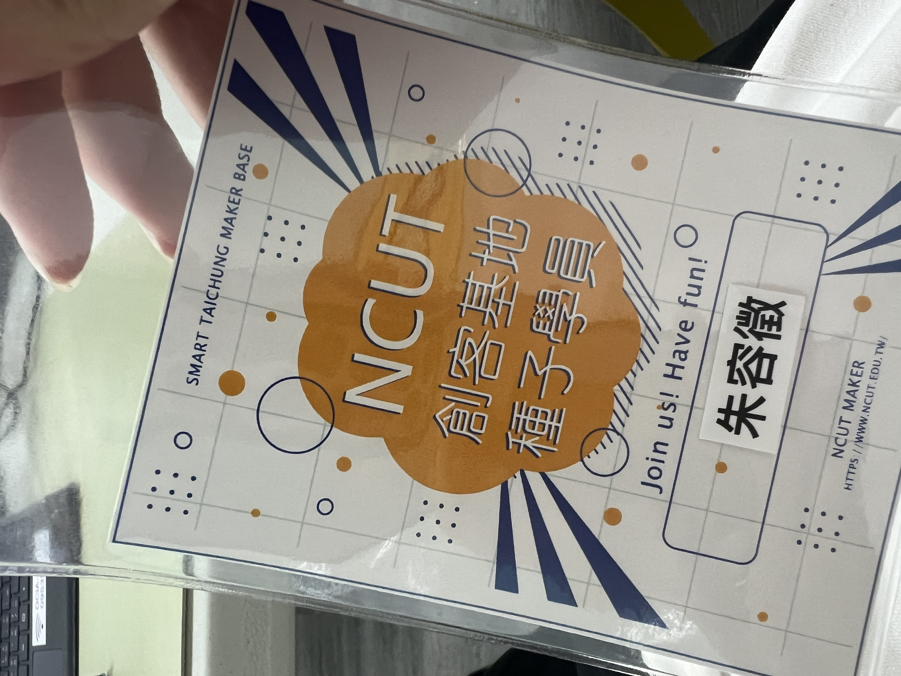
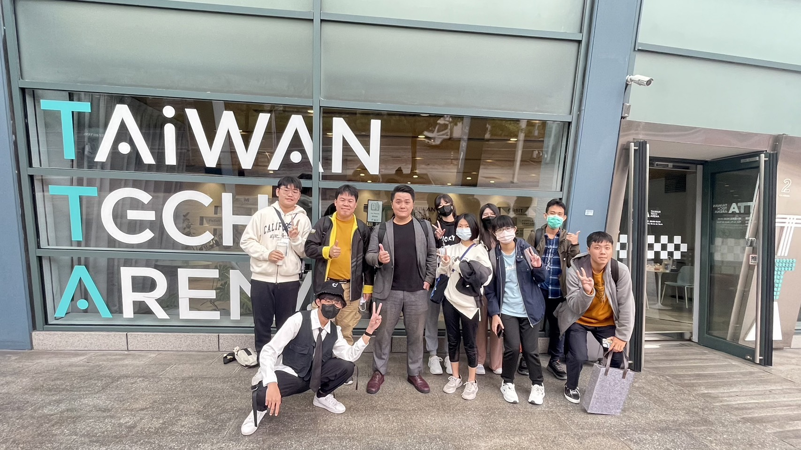
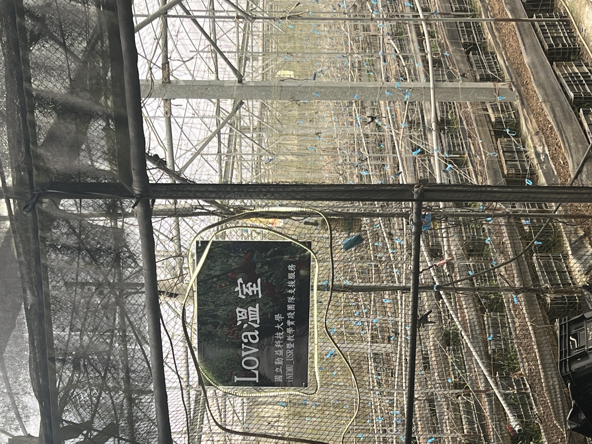
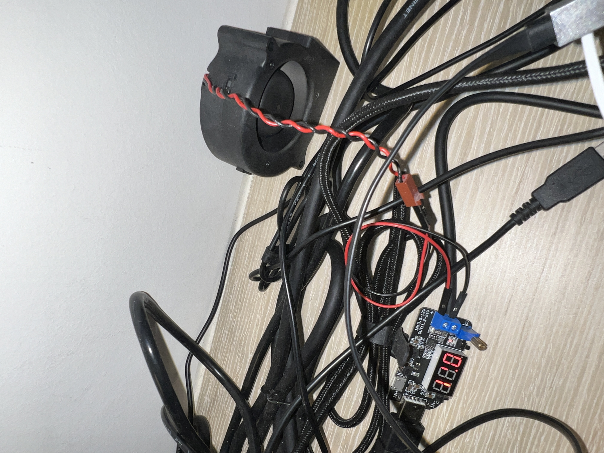
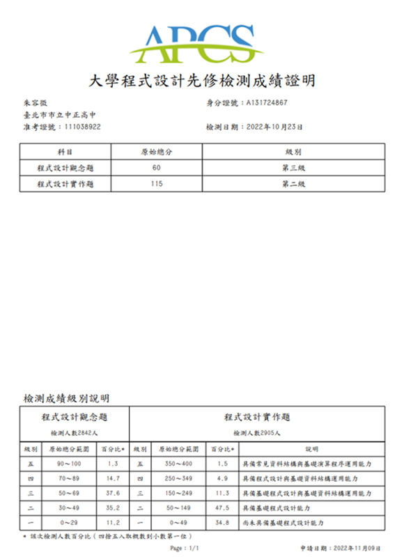
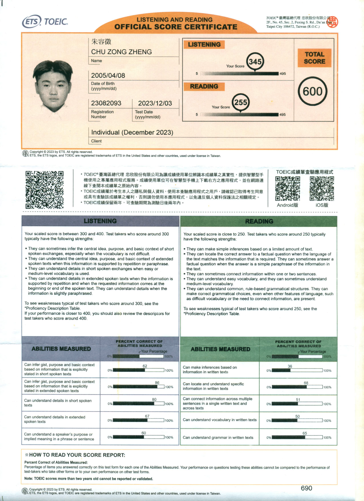

# 朱容徵｜ᴢᴏɴɢ ᴢᴏɴɢ 的個人網站
> 這是關於朱容徵自述的網站。

# 目錄
- [目錄](#目錄)
- [自我介紹](#自我介紹)
- [研習比賽](#研習比賽)
- [作品](#作品)
- [證照](#證照)
- [其他](#其他)
- [網站日記](#網站日記)

# 自我介紹
你好😜，我叫朱容徵，高中畢業於台北市立中正高中。  
我的個性樂觀但會想到會壞的結果；決定了目的就不放棄卻不迂腐。  
本身興趣在電腦科學，軟體設計、遊戲設計、資訊安全、圖像辨識、物聯網。  
專業擅長`C99`、`Python3.7.0`、`Java8`；會用`C++`、`C#`、`HTML&CSS&JS`。  
心理的夢想是可以財富自由，對我來說就是**去吃爭鮮都不用數盤子**🤣。  
希望可以考上好學校，還有賺大錢帶家人出去世界看看。

> 君子務本，本立而道生。

# 經歷
- ## 啟發
	在國小時因為使用Scratch而對電腦科學產生了興趣，後來也自己動手做了遊戲、動畫，甚至在校內比賽的到特優。至此，我對電腦科學的興趣徹底萌芽。
	
- ## 高中三年
	高一，感謝中正高中賴和隆老師的啟發，我下定決心先學習一種高階語言以打好程式基礎。於是，我選擇賴老師推薦的C語言作為我的地基石，再利用學校的程式競賽平台18dice磨練程式設計技巧，與上網自學語法、debug，自學掌握第一種程式語言。

	高二，我使用C語言參加APCS、IOT海選、校內競賽、日常刷zerojudge的方式反覆訓練程式競賽技巧。爭取獲得好成績的同時，養成在固定時間內設計指定程式的能力，順便提升抗壓性。
	
	高三，我對不斷重複的程式競賽感到厭倦，覺得這跟我當初想接觸電腦科學的想法不一致。因此我決定利用我在程式競賽累積下來的實力，去做出一些自己有興趣的side project。學習Design Pattern，並且了解可讀性、可維護性、可變更性的專案開發要求，學習製作專題的能力。  
	
	在此同時，比起讀自己沒有興趣的課程，我更傾向於鑽研資訊領域。我會在有興趣的科目投入大量時間練習、鑽研，並且盡力做到完善。而且在製作資訊專題時，我獲得到很多的快樂、成就感、滿足感。

- ## 大一
	大一，進了國立勤益科大就讀，參加了許多課外活動，譬如加入智慧台中創客基地，成為種子學員、參加大學伴計畫。也體驗到了新的事物，第一次班排一兼系排一、第一次騎車從台中騎回台北玩、第一次住在學校。我覺得很新奇也很安逸舒適，但是後來隱約覺得這所學校環境不太適合我。比如說，我希望能遇到更多志同道合且能力相當的同學，很懷念以前同組成員為了比賽專題通宵奮鬥、絞盡腦汁的情懷。以下是幾點對我來說很酷的活動。
	
- ## 智慧台中創客基地 種子學員
	智慧台中創客基地位於勤益科大的工具機大樓4F，主要提供創客們場地、設備做使用。創客們可以在基地使用工業型機具（e.g. 水冷雷雕機、木工鉋木、金工桌、大型3D列印機、etc.）主要是提供創客創造之外，對本校學生提供創業幫助，很希望學生去創業或是創意競賽（黑客松之類的）。  
	種子學員則是學校的工讀生，負責維護、檢修基地內的設備，還有教導使用者操作機具與維護安全暨宣導正確操作觀念，不過要當種子學員需要經過創客基地負責教授，電子系顏孟華教授的面試，需要具備創客精神，和會基本機具操作、維修，以及突出專業技能，不過，成為種子學員後每個月會有2000元的補助費和免費使用設備的福利，蠻不錯的。由於我的專業能力偏向軟體，所以我主力是負責資訊相關的工作（維護基地那些的還是得做啦😂）。
		
	可惜的是我第一次成為種子學員也應該會是學校最後一屆，由於學校經費問題，種子學員在112學年度上學期結束後就先解散了，想當初還幻想自己可以在基地學習四年。我們工讀生總共也只有三位，後來新增一位機動成員。在這段時間，用幾句話總結就是很辛苦、學習的要很用力、常常被老闆罵、需要會待人處事、抗壓性要強、感覺跟進入職場沒兩樣。因為我是高中生，對於操作那些機器很不熟悉，機具說明書有時候我也看不懂😢，因此常常有問題都需要別人教，還好跟我共事的機械系張學長對我很好，很有耐心的教學機具使用（當時如果你沒教我我就掰掰了😖），另一位陳學姊對人也很好😊，人超好。
		
	日常工作就需要經常處理使用者對機台使用的問題；如果沒事就坐在值班台做自己的事；如果有課程需要，也要幫忙老師授課準備（e.g. 整理環境、拿白板、接螢幕、課堂錄影、活動紀錄、大合照、etc.），有時候粗心忘記某件事等待我的就是究責（所謂職前訓練也就是老闆在白板上講一下怎麼拿錢和要做的工作內容，大概就兩三個小時，之後我就得實際上陣，有點冤啊，也沒有人帶著走一遍實際流程之類的😭）。

	總而言之言而總之，我在這裡最大的收穫就是，會一點職場待人處事、抗壓性變更強、學會某些機台操作、知道某些事情是沒有犯錯的空間。雖然不簡單，但是很有收穫！

	

	> 上圖備註：這是我的值班工作證。
	
	

	> 上圖備註：左邊第1個白色外套是我、第2個黃色毛衣是顏教授、第3個灰色西裝是星進公司的業師Terry。  
	> 我們那天去星進股份有限公司企業參訪，還有了解創意思維跟未來商機趨勢。

	<!-- [文章篇幅有限，點擊此處了解更多呦...😜](./) -->

- ## 大學伴
	這個計畫的目的是補強參加此計畫的小學伴（國小或國中）的弱點科目和學習學校之外的知識技能，和給予陪伴，類似家教，不過更著重於像是朋友般的輔導。我總共教過四位小學伴（路上國小、溪尾國小、雙溪國中、廣興國小，其餘訊息需要保密不能公布），我參加此計畫是想增進自己的口語表達能力，**如何將一件事情以簡單的敘述，說給完全不會的人聽，並且能讓他聽懂**，還有，在教學的時候（譬如程式設計），我也可以利用這個機會查補知識的缺漏，經過說出來這個行為發掘自己不會、說不清楚的細節，再去針對問題學習。總而言之，大學伴這個計畫不只讓我獲益多，我相信小學伴也得到了知識補強和陪伴。

	

	
	> 上圖備註：這是我的大學伴相見歡工作證。

	

	
	> 上圖備註：112學年溪尾國小相見歡。

	<!-- [文章篇幅有限，點擊此處了解更多呦...😜](./) -->

- ## 微學分 智慧農業物聯網規劃與實作
	國立勤益科大資工系林宗宏教授的教學溫室，與南投信義鄉當地原住民合作，教學農業智慧物聯網，主要是利用開發版製作數據盒子，負責記錄當下數據，再由統一電腦做判斷（e.g. 濕度如何，需要澆水嗎?、照度如何，要開燈嗎?）。我們這一次去主要是進行數據盒子的維修作業，但是由於這是活動是參訪性質，加上我們不是實驗室的研究生，因此主要負責記錄活動、觀摩和問問題。  
	此溫室本身多半種植高經濟作物，例如咖啡等，需要精密控制植物生長環境，因此可以利用物聯網技術搭配感測器，與圖形化溫室狀態控制面板。得到全天候當地的感測數據，也可以配合自動化設備進行澆水、開燈等動作。  
	經過此次實地參訪，我覺得農夫真的很辛苦。我們當時下午去的，但是太陽還是很大，我記得溫室裏面是達到35˚C，非常炎熱又很悶熱，跟台北夏天天氣差不多，難以想像要在這裡面長時間種植、採集作物，粒粒皆辛苦確實如此。

	

	
	> 上圖備註：Lova溫室，溫室樣貌。

	

	
	> 上圖備註：教授與助教實地考察與教學、修復損壞設備。  
	> 我是拿相機負責錄影紀錄的工作。

	<!-- [文章篇幅有限，點擊此處了解更多呦...😜](./) -->

----

# 興趣
- ## 打程式
	我很喜歡打code，我覺得在寫程式就像在寫文章一樣，可以用不同的方式寫出很酷的功能。  
	而且能夠獨立打出2000行以上的的複雜程式，還符合功能需求可以執行，真的是超有成就感。  
	拿台筆電，就可以做很多事情，可以做出絢麗動畫；可以將想像中的遊戲付諸實現；可以做出手寫辨識。這對我來說都超有趣的，而且潛力無窮，也許以後會變成穿梭在現實與虛擬之間。
	
	

	
	> 上圖備註：太空侵略者 Space Invaders。

	

	
	> 上圖備註：Unity 2D 做像素冒險遊戲。

	

	
	> 上圖備註：利用 airmon-ng 抓封包與破解 Wi-Fi AP 密碼。

	<!-- [文章篇幅有限，點擊此處了解更多呦...😜](./) -->

- ## 玩小電子材料
	譬如Arduino、ESP32等等開發版，這麼小小的一塊卻可以DIY加上很多感測器，透過程式的編寫還可以做到自動化設備，IoT開燈、自動澆水。甚至某些強大一點的開發版，還可以裝上Linux跑程式，順暢跑AI模型。  
	尤其最近我迷上了控制開發版的電壓去連接一些電子設備，例如：風壓風扇、直流馬達、伺服馬達，那個風壓風扇動起來真的很酷，而且這樣離我手做大型無人機的目標又近了一步。

	

		
		
	

	
	> 上圖備註：最近牛市，想著用開發版挖礦，這是在宿舍桌上，很環保🤣。

	

	
	> 上圖備註：手動接了一個風壓風扇降溫變壓器。

	<!-- [文章篇幅有限，點擊此處了解更多呦...😜](./) -->

- ## 寫書法
	我上個暑假有在練書法，本來想著寫春聯，但是後來過年回老家了，就沒寫了。  
	會練書法是因為國小班導的教誨，他說過：

	> 字寫得正，人也不會歪。  
	
	> 「人」這個字要寫得好，心就要正。

	後來我因為學業還有時間不足就沒有固定練習了，不過有長空窗期的時候就會拿出來練字。

	

	
	> 上圖備註：這是我在去老家之前練了一星期的古詩（我寫的），字寫的不甚好，我要加油。

	<!-- [文章篇幅有限，點擊此處了解更多呦...😜](./) -->

- ## 撰詩詞
	也不知道是為什麼有這種興趣，這是從高中畢業當天開始想的，就有感而發，覺得不寫不快。後來就寫了，給各位客官瞧瞧。

	> 〈畢業〉  
	> 陰雲翻墨千鈞擔，白雨驟降播心弦。  
	> 三年談笑如春風，駒光一逝不復返。  
	> 青青芳草憐人愛，絲絲愁緒誰能解？  
	> 但願長醉不復醒，快似神仙游太虛。  

	當時還取了個筆名叫落魄書生，哈哈哈。不過確實如此，不暗試式，遂得一窮途末路，昔年洪賊，不過如此。
	後來看了很多非儒家典籍，《金剛經》、《道德經》、〈齊物論〉。希望能透過明宋以前的思想幫助我擴展眼界，不過因為如此倒是對儒道釋有了更深的見解，推己及人（講求從自己開始發散到幫助別人，我認為是順序）、自然而然（順應自己的本心）、莫向外求（不要向外強求，自立自強）。希望能因此成為更好的人。

	<!-- [文章篇幅有限，點擊此處了解更多呦...😜](./) -->

- ## 看小說
	我很喜歡看小說，我很愛看那種修仙武俠傳，有幾本我覺得很有意思的書，「明史演義」、「劍來」、「武煉巔峰」、「全職法師」、「神魂丹帝」。對於那些一個個充滿想像力的世界感到新奇，總覺得能將小小的文字構築出形形色色的人物和世界很厲害，尤其是劍來，將人物與劇情刻畫之深，讓我對未來的美好又更崇景了幾分。明史演義則是讓我覺得那些成就非凡事物的人都經歷過不平凡的事，朱元璋能依仗小小的船打敗掌有雄偉戰艦百餘艘的陳友諒，可謂佩服其膽魄之大。看小說是我在手機上的娛樂方式，讓自己放空充電一下，還能提高想像力，有時也可學到一些名言、生僻字。

----

# 研習&比賽
- ## 高中三年
	| 研習活動 | 舉辦單位 |
	| ---- | :--: |
	| 中正高中 資訊研究社 | 臺北市立中正高中 |
	| 2021 北區高中職資安社團體驗營 | 教育部 |
	| IBM SkillsBuild Challenge 2021 | CSR Intern, IBM Taiwan |
	| 台大資訊之芽培訓計畫 北區Python語法班 | 國立臺灣大學 |
	| SYSTEX精誠資訊、訊連科技、玩美移動 企業參訪 | 國立臺灣大學 |
	| 教育部先進資通安全實務人才培育計畫 AIS3 新型態資安暑期課程 | 教育部 |
	| 教育部先進資通安全實務人才培育計畫 AIS3 Juniors 新型態高中職資安暑期課程 | 教育部 |
	| 2022年 APCS 課程 | 國立臺灣師範大學 |

	<!-- - 中正高中 資訊研究社 美編、總務
	- 2021 北區高中職資安社團體驗營
	- 110學年度 科展 佳作
	- 111學年度 科展 佳作
	- IBM SkillsBuild Challenge 2021
	- 台大資訊之芽培訓計畫 北區Python語法班
	- SYSTEX精誠資訊、訊連科技、玩美移動 企業參訪
	- 教育部先進資通安全實務人才培育計畫 AIS3 新型態資安暑期課程
	- 教育部先進資通安全實務人才培育計畫 AIS3 Juniors 新型態高中職資安暑期課程
	- 2022年 APCS 課程 -->

- ## 大一
	| 研習活動 | 舉辦單位 |
	| ---- | :--: |
	| 智慧台中創客基地 種子學員 | 國立勤益科技大學 產學處 |
	| 盈錫精密工業股份有限公司企業參訪 | 國立勤益科技大學 產學處 |
	| 112年 Meet Taipei 創新創業嘉年華 | 國立勤益科技大學 產學處 |
	| 星進股份有限公司企業參訪 | 國立勤益科技大學 產學處 |
	| 大專校院創業實戰模擬學習平臺 | 國立勤益科技大學 產學處 |
	| 112年 數位學伴計畫 | 教育部 |
	| 2024 AWSome Day 線上雲端培訓日 | 國立勤益科技大學 產學處 |
	| 113年 數位學伴計畫 | 教育部 |
	| Lova溫室 iNEMU_USR暨教學實踐團隊支援服務 實地參訪 | 國立勤益科技大學 資工系 |
	| 2024地方創生創意會展行銷競賽 | 中山醫學大學、國立勤益科技大學、舜元建設股份有限公司 |

	<!-- - 智慧台中創客基地 種子學員
	- 盈錫精密工業股份有限公司企業參訪
	- 112年 Meet Taipei 創新創業嘉年華
	- 星進股份有限公司企業參訪
	- 大專校院創業實戰模擬學習平臺
	- 112年 數位學伴計畫
	- 2024 AWSome Day 線上雲端培訓日
	- 113年 數位學伴計
	- 2024地方創生創意會展行銷競賽 -->

----

# 作品
- ## 高中三年
	| Side Project 名稱 | 使用技術 | 簡述 |
	| ---- | :--: | ---- |
	| 使用 C 實作經典加密演算法 | `C` | 對密碼學中眾多的加密演算法，要如何在電腦上實際運行，感到興趣。挑選了幾個經典的加密演算法實作。 |
	| 貪吃蛇 Snake game | `C` | 對 Google 上的貪食蛇小遊戲感到興趣，並且臨時想到如果能在終端機上做遊戲很酷。 |
	| 踩地雷 Miner game | `C` | 朋友的自主學習計畫，我提供技術指導。要做出踩地雷遊戲。 |
	| 太空侵略者 Space Invaders | `Python` | 資訊之芽的期中大作業。本來只需要讓玩家動起來並讓敵人能夠發射子彈便可以，但是我覺得很有趣，我便增加了無敵模式、敵人血量時數量變少速度變快；子彈發射數量變多速度變快。 |
	| 使用 Python 對可施打公費疫苗之診所.csv 檔案進行數據分析 | `Python` | 朋友的自主學習計畫，我提供技術指導。要爬蟲衛生福利部的可施打公費疫苗之診所.csv 檔案，並做出 Ctrl+F 快速搜尋鍵的功能。 | 
	| 使用 Python 實作 Discord 聊天機器人 | `Python` | 資訊之芽期末大作業。要在裡面放上 1A2B 遊戲，和 TODO List 功能。後來我覺得這樣太枯燥了，便增加撥放音樂功能、敷衍聊天功能，並去除不可預期事件，讓機器可以 24/7 運行。 |
	| 基於 Discord ChatBot 的自動偵測地震回報系統 | `Python` | 之前 9/18 強震沒有收到國家級警報避難通知，感覺這樣很不可靠，我就覺得需要自己架設一個爬蟲系統來保障地震預警的傳遞，免得又沒有收到。 | 
	| 探討機器學習對電子競技的影響 | `Python` | 偶然看見由 AI 圖像辨識做成的遊戲外掛，就好奇這個新興外掛效用如何？使否可以被遊戲偵測？對遊戲的影響為何（公平性）？ | 
	| 使用 AI 圖像辨識進行垃圾分類之探討 | `Python` | 馬路上政府設立的二分類垃圾桶（一般垃圾、資源回收）常常被民眾亂丟。因此想比較、選擇 AI 圖像辨識模型中最優秀的模型來解決這個社會問題（原先是利用 CNN做自動垃圾分類機器）。 |
	| 街機遊戲 Atmosphere Guardian 太空守護者 | `C#` | 想製作古早味街機遊戲，像是「雷電」街機遊戲。 |
	| 2D 平面 RPG 遊戲 Endless Darkness 無盡黑暗 | `C#` | 以我現在技術單單用 C、Python 製作遊戲都有點簡陋，沒有像 3A 大作那樣的光影系統渲染圖片，因此我想使用 Unity 製作出以美術為重點項目的遊戲作品。 |
	| BGP 劫持對學術網路威脅 | `其他` | AIS3 結訓專題報告。我們這組只有我一個高中生，加上關鍵基礎設施不易有實作內容。因此題目定向傾向為有經驗台科大學長專長的 BGP 挾持。 |
	| 中正高中 AP 弱密碼破解 | `其他` | 想使用學校的強訊號 Wi-Fi，但是被密碼鎖住了，只讓老師用，就想破解完後分享給大家使用。經過不斷的摸索規律，已知密碼排序為 8bit 小寫字母，總共用 26^8 種可能，後來去網咖把它暴力破解出來了，可惜筆電沒有辦法。 |

- ## 大一
	| Side Project 名稱 | 使用技術 | 簡述 |
	| ---- | :--: | ---- |
	| 國立勤益科技大學全自動連接網路腳本 | `Python` | 因為學校網路經過12小時會斷開連結，所以我製作了一個**爬蟲腳本**可以偵測斷網時自動重新連接網路。 |
	| A CHU TECH 's blog | `HTML`&`CSS`&`JS` | 使用喘統前端標記語言製作的個人網站。負責公開展示我的履歷、表現、專業、作品。 |
	| MakerBar | `HTML`&`CSS`&`JS` | 024 第 7 屆 致青春創未來全國選拔大賽 參賽作品。製作一個提供創客者和對 3D 列印有需求者，商品交易、交友、論壇的平台，類似模型界的蝦皮、PChome。 |
	| 朱容徵 zong zong | `Markdown`&`HTML`&`CSS` | 主要使用 Markdown 製作**個人網站**，簡潔、明確、方便。 |

----

# 證照
- ## 高中三年
	- GEPT 中級
		
		

	- APCS 4+3

		

			
			
		

	- IPAS 資訊安全工程師 初級

		

- ## 大一
	- TOEIC 600

		

	- CSEPT 230

		

	- ICT使用 Python 程式設計 核心能力 / ICT using Python Programming - Essentials Level

		

		
		> 在學校試場確定通過測驗，電子、紙本成績單尚未出來。

----

# 其他
- ## 其他社群連結
	- ####  [**GitHub**](https://github.com/zongzong0408)
		- ##### ref: [*https://github.com/zongzong0408*](https://github.com/zongzong0408)
	- ####  [**Youtube**](https://youtube.com/@zongzong0408)
		- ##### ref: [*https://youtube.com/@zongzong0408*](https://youtube.com/@zongzong0408)
	- ####  [**Discord**](https://discord.com/users/zongzongchu0408)
		- ##### ref: [*https://discord.com/users/zongzongchu0408*](https://discord.com/users/zongzongchu0408)

----

# 網站日記
這是關於朱容徵自述的網站，此處撰寫本網站的重要事件摘要。    

| 時間 | 代號 | 事件 |
| :--: | :--: | ---- |
| 2024/04/20 | `二哈` | 我的個人網站在 ***github.io*** 創建！`二哈` 階段結束。 |
| 2024/04/30 | `柯基` | 網站主頁內容更新至 **大一**。 |
| 2024/05/17 | `柯基` | `二哈` 到 `柯基` 所有內容完成編輯並停止更改，`柯基` 階段結束。 |